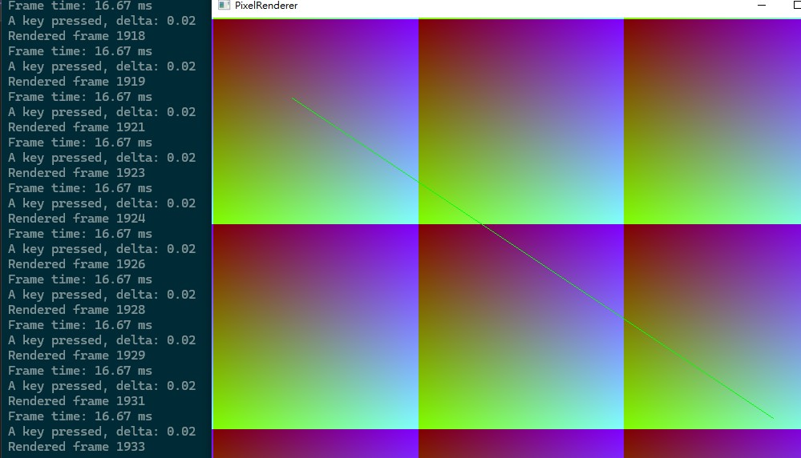

# Pixel-Renderer



## Overview
Pixel-Renderer is a basic template for software rendering on Windows using the Win32 API. It provides a modular framework for drawing pixels, lines, and triangles efficiently, ideal for learning the fundamentals of computer graphics pipelines. The project uses Device-Independent Bitmaps (DIB) for high-performance pixel manipulation and supports a simple game loop with input handling.

## Features
- Efficient pixel buffer operations using DIB for software rendering.
- Modular structure: ScreenManager for window and input, RenderDevice for drawing, Application for custom logic.
- Supports keyboard and mouse input.
- Retains console for debugging (e.g., printf output).
- Easy to extend for full graphics pipelines (rasterization, shading, etc.).
- No external dependencies beyond Win32 API (links to gdi32 and user32).

## Getting Started
### Prerequisites
- Windows OS.
- MinGW or MSVC compiler.
- Visual Studio Code (optional, for tasks.json setup).

### Building
1. Clone the repository:
   ```
   git clone https://github.com/yourusername/Pixel-Renderer.git
   ```
2. `g++ -g main.cpp application.cpp render_device.cpp screen_manager.cpp -o PixelRenderer.exe -lgdi32 -luser32`
3. Run `PixelRenderer.exe` to see the demo (draws a line; press ESC to exit).

### Usage
Inherit from `Application` and override methods:
```cpp
class MyApp : public Application {
public:
    MyApp() : Application(800, 600, L"My App") {}
    void OnRender() override {
        device->Clear(0x000000);
        device->DrawLine(100, 100, 700, 500, 0x00FF00);
    }
};

int main() {
    MyApp app;
    app.Run();
    return 0;
}
```
