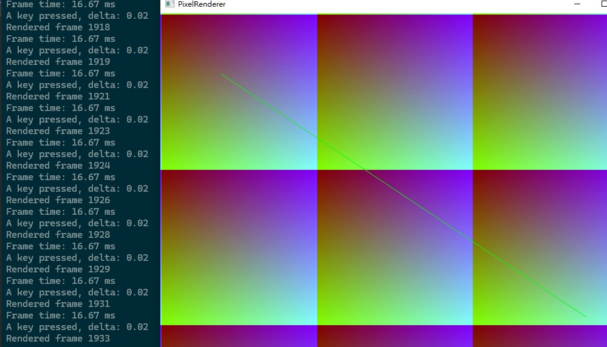

# Pixel-Renderer



## Overview
Pixel-Renderer is a basic template for software rendering on Windows using the Win32 API. It provides a modular framework for drawing pixels, lines, and triangles efficiently, ideal for learning the fundamentals of computer graphics pipelines. The project uses Device-Independent Bitmaps (DIB) for high-performance pixel manipulation and supports a simple game loop with input handling.

## Features
- Efficient pixel buffer operations using DIB for software rendering.
- Modular structure: ScreenManager for window and input, RenderDevice for drawing, Application for custom logic.
- Supports keyboard and mouse input.
- Retains console for debugging (e.g., printf output).
- Easy to extend for full graphics pipelines (rasterization, shading, etc.).
- No external dependencies beyond Win32 API (links to gdi32 and user32).

## Getting Started
### Prerequisites
- Windows OS.
- MinGW or MSVC compiler.
- Visual Studio Code (optional, for tasks.json setup).

### Building
1. Clone the repository:
   ```
   git clone https://github.com/yourusername/Pixel-Renderer.git
   ```
2. Manual Build (in Git Bash terminal)
    - Debug: make debug (outputs to build/debug/PixelRenderer_debug.exe)
    - Release: make release (outputs to build/release/PixelRenderer_release.exe)
    - Clean: make clean

3. Open bulid dir to run `PixelRenderer_xxx.exe` to see the demo.

### Usage
Inherit from `Application` and override methods:
```cpp
class MyApp : public Application {
public:
    MyApp() : Application(800, 600, L"My App") {}
    void OnRender() override {
        device->Clear(0x000000);
        device->DrawLine(100, 100, 700, 500, 0x00FF00);
    }
};

int main() {
    MyApp app;
    app.Run();
    return 0;
}
```


## Directory Tree

```
.
├── src/
│   ├── core/                # [Stable] 基礎設施層 (Infrastructure)
│   │   ├── screen_manager.h/cpp   # Win32 視窗與事件循環
│   │   ├── render_device.h/cpp    # 像素緩衝管理 (SetPixel, Swap) 待拆分 (Refactor Pending)
│   │   └── application.h/cpp      # 應用生命週期與時鐘管理
│   │
│   ├── render/              # [In Progress] 渲染邏輯層 (Graphics Logic)
│   │   ├── rasterizer.h/cpp       # ⏳ 規劃中: 三角形光柵化算法 從 RenderDevice 移入
│   │   ├── shader.h/cpp           # ⏳ 規劃中: 著色器接口與頂點/片段處理
│   │   ├── texture.h/cpp          # ⏳ 規劃中: 紋理加載與採樣器
│   │   └── lighting.h/cpp         # ⏳ 預計: 光照模型與法線計算
│   │
│   ├── ui/                  # [Planned] 使用者界面層
│   │   └── ui_context.h           # 整合 libiui/microui 
│   │
│   └── main.cpp             # 程式入口 (組合 Core 與 Render)
│
├── docs/                    # 開發筆記與圖形學原理
├── CMakeLists.txt           # 全域構建配置
└── .gitignore
```

## TODO
* [ ] Follow the tutorial
* [ ] UI library like [libiui](https://github.com/sysprog21/libiui) / [microui](https://github.com/rxi/microui)


